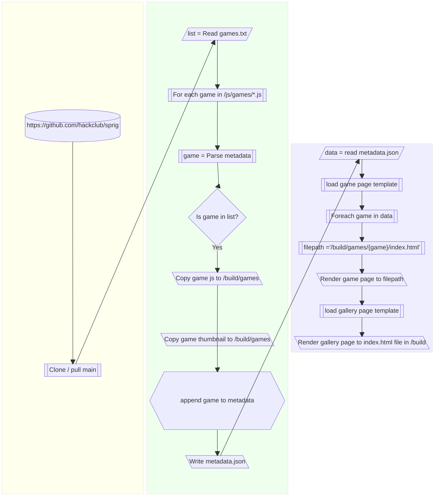

# Sprig Arcade

First set of issues are over here https://github.com/UTCSheffield/sprig-arcade-fork/issues

We are now going to build in python & jinja with an aim to build on github pages.

## General Idea

